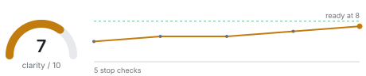
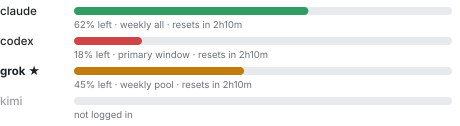

# claude-code-cockpit

A Claude Code mod that adds a **Cockpit** pane and a status band above the prompt. It shows how clear an interview has become, enforces the interview's rules, and keeps an eye on the agent tooling around it: AI quota, hook runs, and background subagent runs.

It works in the Claude Code desktop app (Code tab), where charts draw as SVG, and in the terminal, where they fall back to text bars.

| Clarity | Quota |
| --- | --- |
|  |  |
| **Hook runs** | **Subagent history** |
|  |  |

The images above come from `hooks/charts.ts` with sample data, rendered by `scripts/render-docs.ts`.

## What you get

**Cockpit pane.** A row of status tiles, then one collapsible card per section:

- **Questioning.** A clarity gauge (0 to 10) with its trend across stop checks, the current picture and what would be built now, slot chips (settled, partial, open), open questions ranked by impact with the cost of guessing wrong, covered and thin lenses, and the enforcer's counters.
- **Quota.** Remaining quota per AI CLI, the tightest window first in color, reset times, and the recommended next worker.
- **Hooks.** Every settings hook run this session with its duration and outcome, the last block, and rows from optional gate logs.
- **Subagents.** Background runs in progress, a strip of recent outcomes, and a history kept across sessions (100 runs or 30 days).

**Band above the prompt.** Clarity during an interview, a pending auto-panel countdown, the tightest quota, live subagent runs, and any hook block from the last ten minutes. `c` opens the Cockpit, `h` hides the band.

**Interview enforcer.** Once an interview reports `start` through the meter tool, the mod:

- blocks an `AskUserQuestion` that has no fresh meter call,
- blocks the question that would pass 4 answers without a stop check,
- warns the model (in the question's result, not to you) on a third question in a row under one lens, or on more questions at clarity 8 with nothing high-impact open.

Nothing is blocked until an interview starts, so a skill that never calls the meter is never affected.

**Auto panel.** When an Approach or Risks item stays open across two stop checks, the pane counts down 30 seconds with a Cancel button, then runs a three-planner [smart-subagents](https://github.com/m-esm/smart-subagents) panel on it and fills a follow-up into your prompt box when it lands. It runs at most once per open item, and skips itself when quota is missing, stale, or exhausted.

## Requirements

- Claude Code with function-hook mods. Built and tested against Claude Code 2.1.288.
- Optional: [smart-subagents](https://github.com/m-esm/smart-subagents) installed so that `~/.claude/scripts/ai-cli-usage.py` and `~/.claude/scripts/smart-subagents.sh` exist. Without it the Quota card says so and the auto panel stays off; everything else works.
- Optional: JSONL logs at `~/.claude/cache/jev-hooks.jsonl` and `~/.claude/cache/delegation-gate.jsonl` from your own hooks. When absent, the Hooks card shows live runs only.

## Install

Clone it anywhere:

```bash
git clone https://github.com/m-esm/claude-code-cockpit.git ~/claude-code-cockpit
```

Terminal, for one session:

```bash
claude --plugin-dir ~/claude-code-cockpit
```

Desktop app, or every session: add the folder to the `env` block of `~/.claude/settings.json`, then start a new session.

```json
{
  "env": {
    "CLAUDE_CODE_PLUGIN_DIRS": "~/claude-code-cockpit"
  }
}
```

Open the pane with `/cockpit` (or `/clarity`). `/clarity reset` clears the interview state.

## Reporting an interview: the meter tool

The mod registers `mcp__claude-code-cockpit__meter`. Any interviewing skill can report through it. Call it right before each `AskUserQuestion` and await the result.

| `event` | When |
| --- | --- |
| `start` | The interview opens. Arms the enforcer. |
| `question` | Before every ordinary `AskUserQuestion`, listing its questions with `lens` and `move`. |
| `stop_check` | When you show the stop check (progress summary), listing its question. Resets the 4-answer counter. |
| `finish` | At wrap-up. Disarms the enforcer. |

Every call carries the whole current picture. Keep each open item's `id` stable across stop checks, because the auto panel tracks items by id.

```json
{
  "event": "stop_check",
  "topic": "billing rewrite",
  "phase": "probing",
  "clarity": 6,
  "picture": "Move invoicing off the cron job onto queue workers.",
  "buildNow": "A queue consumer that mirrors the cron job's output.",
  "assuming": ["Invoices can be generated out of order"],
  "slots": [
    { "id": "goal", "label": "Goal", "state": "settled" },
    { "id": "approach", "label": "Approach", "state": "partial" }
  ],
  "openItems": [
    { "id": "retry-policy", "slotId": "approach", "question": "Retry or dead-letter failed invoices?", "impact": "high", "costOfWrong": "duplicate charges" }
  ],
  "lensesCovered": ["User", "Outcome"],
  "lensesThin": ["Risk"],
  "questions": [{ "text": "Where next?", "lens": "Risk", "move": "Converge" }]
}
```

Lenses: User, Outcome, Scope, Execution, Constraint, Risk, Alternative, Contrarian. Moves: Clarify, Dig, Explore, Challenge, Brainstorm, Panel, Converge. The full JSON schema is `METER_SCHEMA` in `hooks/interview.ts`.

A second tool, `mcp__claude-code-cockpit__status`, returns the whole Cockpit as JSON for an agent to read.

## Layout

| Path | What it holds |
| --- | --- |
| `hooks/register.tsx` | Hook wiring: tools, enforcer, feeds and timers, auto panel, render hooks |
| `hooks/components.tsx` | The Cockpit, its section cards and the band |
| `hooks/charts.ts` | SVG chart builders with a light and dark palette |
| `hooks/interview.ts` | Meter schema, interview state machine and enforcer rules |
| `hooks/feeds.ts` | Parsers for quota, hook logs and subagent run folders |
| `hooks/meter.ts` | Fallback parser for a stop check printed as text |
| `types/index.d.ts` | The mod's state contract |
| `tests/` | Enforcer, feed, chart and render tests |

## Development

```bash
claude plugin validate .
claude plugin test .
node --experimental-strip-types scripts/render-docs.ts --check
```

`tsc -p .` type-checks once Claude Code has loaded the folder, because the engine writes the API types into `.claude-plugin/types/` (ignored by git) on load. After changing `hooks/charts.ts`, regenerate the README images with `node --experimental-strip-types scripts/render-docs.ts`.

## License

MIT
